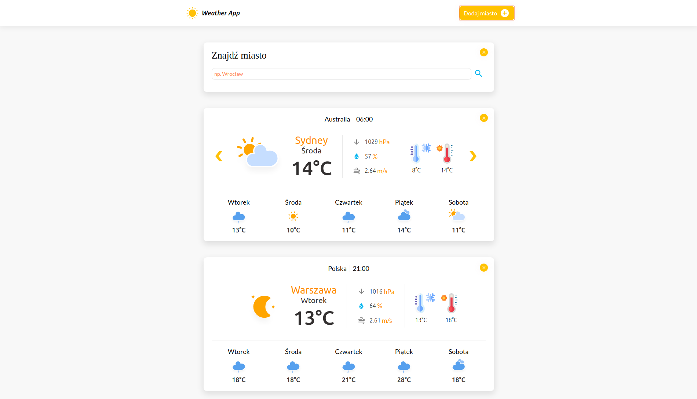

# City weather

Aplikacja napisana w języku JavaScript z użyciem NodeJS.
<p>Korzysta ona z api "Opean Weather", dzięki której możemy sprawdzić pogodę w niemal każdym mieście na świecie wraz z prognozą wyszczególnioną godzinowo na łącznie 5 dni.</p>
<p>Aplikacja wyświetla na stronie głównej prognozę pogody na podstawie szerokości geograficznej,
z której aplikacja zostaje uruchomiona, dlatego też przeglądarka może prosić o udostępnienie lokalizacji.</p>



## Uruchom aplikację

Najpier należy pobrać unikalne API_KEY ze strony [https://openweathermap.org/api](https://openweathermap.org/api), które otrzymamy po darmowej rejestracji.<br>
Następnie w pliku open-weather.js, który znajdziemy w katoalogu /weather_app/js należy podać otrzymany API_KEY : 

```
open-weather.js


const OW_API_KEY = 
```

### `npm run build | npm start`

Uruchamia aplikację lokalnie<br />
Otwórz [http://localhost:5000](http://localhost:5000) aby zobaczyć rezultat w przeglądarce.

## Contact 
zofiawasilonek@.gmail.com<br>
<a href="https://www.linkedin.com/in/zofia-wasilonek/">Linkedin</a>
